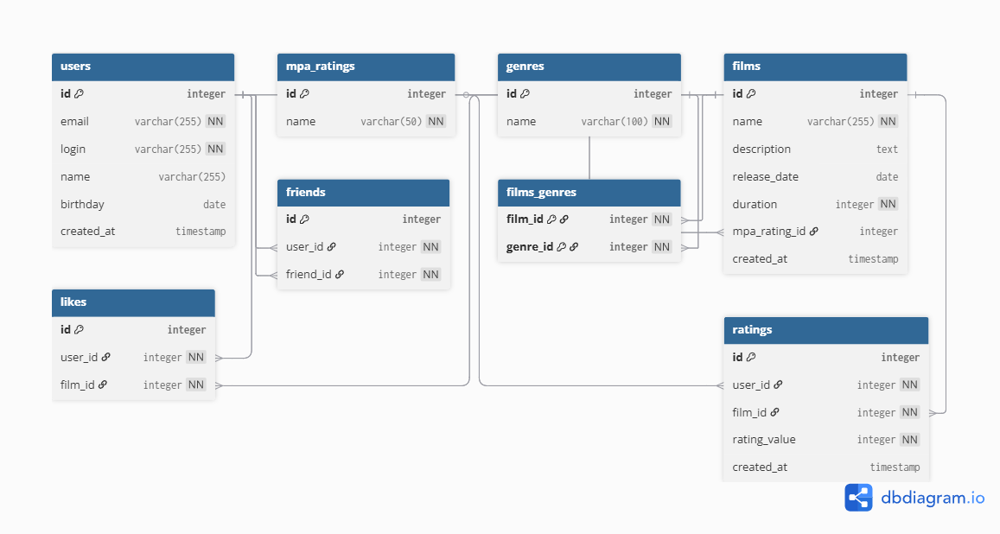

# java-filmorate
Template repository for Filmorate project.

-- Создание пользователя
INSERT INTO users (email, login, name, birthday, created_at) 
VALUES ('example@example.com', 'userlogin', 'User Name', '1990-01-01', NOW());

-- Получение всех пользователей
SELECT * FROM users;

-- Обновление информации о пользователе
UPDATE users 
SET name = 'New Name', birthday = '1991-01-01'
WHERE id = 1;

-- Удаление пользователя
DELETE FROM users 
WHERE id = 1;

-- Добавление жанра
INSERT INTO genres (name) 
VALUES ('Action');

-- Получение всех фильмов определенного жанра
SELECT * FROM films 
WHERE genre_id = 1;

-- Добавление лайка к фильму
INSERT INTO likes (user_id, film_id) 
VALUES (1, 1);

-- Получение всех лайков для конкретного фильма
SELECT * FROM likes 
WHERE film_id = 1;

-- Создание отношения дружбы
INSERT INTO friends (user_id, friend_id) 
VALUES (1, 2);

-- Получение всех друзей пользователя
SELECT u.* FROM friends f
JOIN users u ON f.friend_id = u.id 
WHERE f.user_id = 1;
